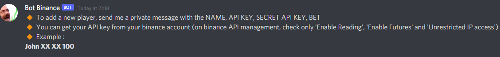
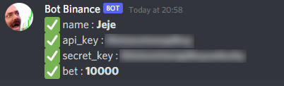
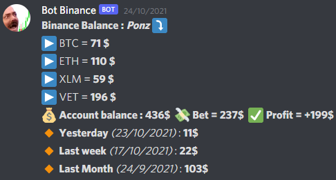
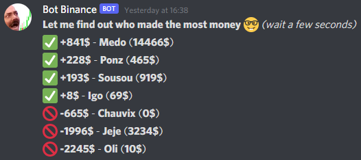
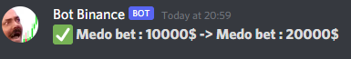

# bot-discord-binance

* Display your Binance balance (spot & futures) on your Discord server
* Check if you are winning or losing money
* Compare your Binance balance with your friends
* Compare your current balance to your previous balance (yesterday, last week, last month)

# Setup

Download Node.js and run this commands to download & install the required modules
```
npm install
```

Modify config.json:
* prefix : the command prefix
* token : the token of your discord bot
* auto_save : if you want to save or not the players' balance every day (at midnight) in db.json
* show_pnl_history : if you want to display the profit and loss of players
* channel_name : the discord channel name where the bot will write
* players : don't touch, this is where the players information will registered
```json
{
  "prefix": "!",
  "token": "",
  "auto_save": true,
  "show_pnl_history": true,
  "channel_name": "",
  "players": []
}
```

And now run the bot

```
node bot.js
```
Note : Your bot needs permission to write in config.json and db.json files

# Commands

Note : The following commands must be submitted in the channel you specified in the config.json file

Add a player :
```
!addplayer
 ```


 And send a private message to the bot with these informations :
 ```
<player_name> <binance_api_public_key> <binance_api_private_key> <player_bet>
 ```
 


Binance balance of a player :
```
!balance <player>
 ```



Binance balance of all players :
```
!balance all
 ```



Set Binance bet of a player :
```
!setbet <player> <new_bet>
 ```



Delete a player :
```
!delete <player>
 ```


